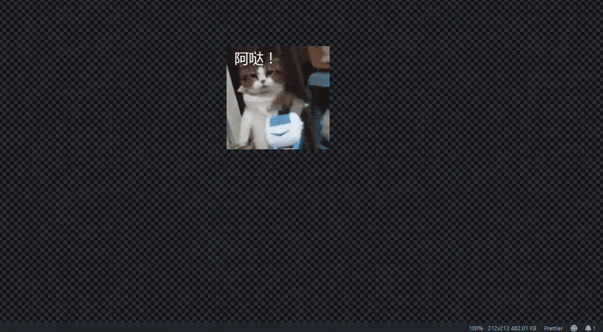

# Remind-me

[](https://badge.fury.io/gh/kelrvins%2Fremind-me)
[](https://github.com/kelrvins/remind-me/stargazers)
[](https://github.com/kelrvins/remind-me)

他们帮你高效工作，而我只在乎你是不是按时吃饭

They help you work efficiently, but I only care if you are eating on time.
***
## Features

提醒你吃饭下班，顺便带上天气

Remind you to do something, eat or get off work, etc. Show current weather and temperature curve



***
## Quick start:
> commands  ```ctrl+shift+,```  开启沙雕生活

> setting

Name | Description | Default 
- | :-: | -: 
remind-me.defaultCity | 城市名，支持拼音和中文(建议) | 南京
remind-me.hefengAppkey | 和风天气KEY(免费),建议使用自己的 | ""
remind-me.lunchTime | 吃饭时间 | 11:30
remind-me.getOffTime | 下班时间 | 18:00


### 1.0.0

remind me sth

**Enjoy!**
